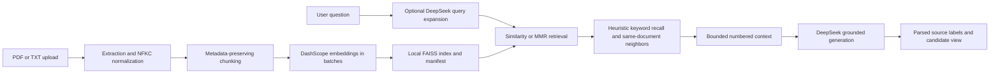

# PrivateDocRAG

PrivateDocRAG is a local, single-user document question-answering prototype that turns text-based PDF and TXT files into a searchable FAISS index, retrieves relevant passages, and asks DeepSeek to answer with explicit source labels. The project focuses on an inspectable RAG pipeline: document normalization, metadata-preserving chunking, batched embeddings, hybrid retrieval heuristics, grounded prompting, and retrieval diagnostics.

This is an Applied AI engineering project and portfolio artifact. It is not a hosted product, a multi-tenant service, a formal benchmark framework, or a production-grade privacy system.

## What problem it solves

Long documents are difficult to search with exact keywords alone. PrivateDocRAG combines semantic retrieval with lightweight Chinese keyword heuristics and neighboring-chunk recovery so a user can ask natural-language questions and inspect the passages supplied to the model.

The application currently supports:

- text extraction from text-based PDF and TXT uploads;
- NFKC normalization and recursive chunking with source/page metadata;
- batched DashScope embeddings with retry and failed-batch isolation;
- local FAISS persistence with a manifest and guarded local reload;
- Similarity or MMR vector retrieval;
- heuristic keyword recall, optional DeepSeek query expansion, and same-document neighbor recovery;
- a grounded answer prompt, explicit source-label parsing, and a candidate retrieval view;
- offline unit tests that mock or avoid paid model calls.

## Architecture



Data flow in one line:

`ingestion → normalization/chunking → embeddings/FAISS → query expansion + hybrid retrieval → context construction → grounded generation → parsed source labels`

## Actual technology stack

| Area | Current implementation |
| --- | --- |
| UI | Streamlit |
| Document parsing | pypdf, plain-text decoding |
| RAG orchestration | LangChain Core, Community, and Text Splitters |
| Embeddings | DashScope `text-embedding-v1` |
| Vector store | FAISS CPU |
| Generation | DeepSeek `deepseek-reasoner` through `langchain-deepseek` |
| Tests | pytest, deterministic fakes, no live provider calls |
| CI | GitHub Actions on Python 3.10 and 3.12 |

OpenAI API calls, MCP, Hugging Face, PyTorch, SQL, OCR, and cloud deployment are not part of the current application.

## Retrieval behavior

The retrieval pipeline is intentionally small and explainable:

1. The original question, plus up to three optional DeepSeek rewrites, is sent through a FAISS Similarity or MMR retriever.
2. A local keyword scorer boosts longer and rarer Chinese terms, chapter names, and numbered phrases.
3. Results are de-duplicated; neighboring chunks are added only from the same uploaded document.
4. A maximum number of chunks is formatted as numbered context for generation.
5. The UI parses source numbers explicitly emitted by the model and separately shows the candidate chunks supplied to generation.

This is heuristic hybrid retrieval, not BM25 score fusion, a learned reranker, or a formal retrieval benchmark. A parsed label such as `[来源2]` shows which candidate the model named; it does not independently prove that the cited passage supports the claim.

Indexes created before per-upload `document_id` metadata was introduced fall back to filename-based neighbor grouping. Reprocess those documents with this version when same-named uploads must remain distinct.

## Setup

### Prerequisites

- Python 3.10 or 3.12. Local verification used Python 3.12; CI tests both versions.
- Network access and valid DeepSeek and DashScope credentials for document indexing and answer generation.
- A machine supported by the `faiss-cpu` package.

From the repository root:

```bash
python3 -m venv .venv
source .venv/bin/activate
python -m pip install -r requirements-dev.txt
```

On Windows PowerShell, activate the environment with:

```powershell
.\.venv\Scripts\Activate.ps1
```

Create a local environment file from the committed template:

```bash
cp .env.example .env
```

Then replace only the placeholders in `.env`:

```env
DEEPSEEK_API_KEY=your_deepseek_api_key_here
DASHSCOPE_API_KEY=your_dashscope_api_key_here
```

The application also accepts the legacy lowercase `dashscope_api_key` name, but new setups should use `DASHSCOPE_API_KEY`. Process-level environment variables take precedence over `.env` values.

## Run the application

Keep the service on loopback; the repository does not implement authentication or tenant isolation.

```bash
python -m streamlit run langchain_rag.py \
  --server.address 127.0.0.1 \
  --server.port 8501
```

Open `http://127.0.0.1:8501/`, upload a text-based PDF or TXT file, and choose **处理文档**. Query expansion is optional and adds one DeepSeek request before retrieval.

The process must be started from the repository root because runtime paths are relative to the current working directory.

## Offline verification

These commands do not require API keys and do not make paid model requests:

```bash
python -m pip check
python -m pytest
python -c "import langchain_rag; print('IMPORT_OK')"
```

For a local headless startup check:

```bash
python -m streamlit run langchain_rag.py \
  --server.headless true \
  --server.address 127.0.0.1 \
  --server.port 8502 \
  --server.fileWatcherType none \
  --browser.gatherUsageStats false
```

The application can start without credentials and will disable indexing and answering until the required variables are present. GitHub Actions runs dependency consistency, the offline test suite, and import smoke checks for pull requests.

## Security and privacy boundaries

“Local index” does not mean “all data stays on this machine.” Review these boundaries before using sensitive material:

| Data | Destination | Purpose |
| --- | --- | --- |
| Extracted document chunks | DashScope | Generate embeddings during indexing |
| Original question and expanded queries | DashScope | Generate query embeddings for retrieval |
| Question alone | DeepSeek | Optional query expansion |
| Question, retrieved chunks, and recent chat history | DeepSeek | Generate the answer |
| Document chunks and metadata | Local `work/faiss_db/index.pkl` | FAISS document store persistence |
| Filenames, page/text statistics, document IDs, and index settings | Local `work/faiss_db/manifest.json` | Index diagnostics and compatibility validation |

Additional constraints:

- The local index is not encrypted. `index.pkl` contains recoverable document text and metadata, not only vectors.
- FAISS persistence uses Python pickle internally. The application enables dangerous deserialization only after checking the fixed local index directory, file types, and manifest compatibility. These checks do not prove provenance or cryptographic integrity. Load only indexes generated by this application and kept under the same trusted OS account: anyone who can modify `index.pkl` may be able to execute code with the application's permissions.
- The shared `work/faiss_db/` path is designed for one trusted local user. Do not expose this Streamlit app to multiple users without authentication, per-user storage, locking, and authorization.
- Uploaded documents are not copied into the repository, but extracted text is persisted in the local index. Clearing the index removes known generated artifacts; storage backups may retain earlier copies.
- `.env`, virtual environments, caches, databases, indexes, and pickle files are ignored by Git. `.env.example` contains placeholders only.
- Retrieved documents and chat history are treated as untrusted data in the system prompt. This reduces prompt-injection risk but does not eliminate it.
- Do not test credentials by committing them or pasting them into issues. Rotate any credential that has ever been committed or shared publicly.

## Current limitations

- Only text-based PDF and TXT files are supported; there is no OCR, table extraction, or image understanding.
- Indexing and generation require external providers, network access, quota, and may incur cost.
- Upload count, total parsed text, provider cost, and model context are not governed by a production quota system.
- Keyword retrieval contains Chinese-language and chapter-number heuristics; generalization has not been formally evaluated.
- Query-expansion failure falls back to the original query. The candidate view does not expose model scores or full per-stage lineage.
- Chat history is included in generation, but retrieval does not yet resolve follow-up references using the full conversation.
- Citation syntax is parsed, not independently evaluated for factual entailment or faithfulness.
- Dependency versions are bounded but not locked to a bit-for-bit resolver snapshot.
- There is no formal benchmark, production monitoring, hosted deployment, authentication, multi-user isolation, or cross-process index-write protection.

## Project structure

| Path | Responsibility |
| --- | --- |
| `langchain_rag.py` | Streamlit entry point and application flow |
| `rag_app/documents.py` | PDF/TXT reading, normalization, and chunking |
| `rag_app/indexing.py` | Batched embeddings, staged replacement, and rollback for handled failures |
| `rag_app/retrieval.py` | Similarity/MMR, keyword heuristics, de-duplication, and neighbors |
| `rag_app/qa.py` | Query expansion, context construction, and grounded prompting |
| `rag_app/sources.py` | Source-label parsing and candidate previews |
| `rag_app/vector_store.py` | Manifest, persistence checks, and cleanup boundaries |
| `rag_app/ui.py` | Streamlit controls, state, and diagnostics |
| `tests/` | Offline unit and reliability tests |
| `.github/workflows/offline-tests.yml` | Pull-request checks |
| `.env.example` | Credential-name template with placeholders only |
| `work/` | Ignored runtime index and diagnostics |
| `git.ipynb` | Historical exploratory notebook; not part of the application path |

## 中文说明

这是一个面向个人本地使用的 RAG 工程原型：文档片段、原问题和改写查询会发送到 DashScope 生成向量，检索上下文、问题和近期对话会发送到 DeepSeek；本地 FAISS `index.pkl` 仍会保存可恢复的文档文本。项目重点是可解释的数据流、离线测试和明确的安全边界，不宣称生产部署、正式评测或多用户能力。

详细历史变更见 [`CHANGELOG.md`](CHANGELOG.md)。
